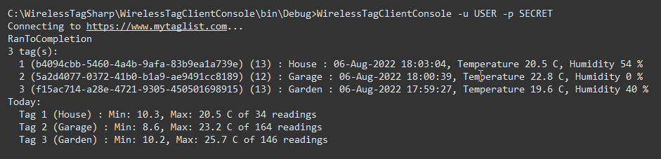
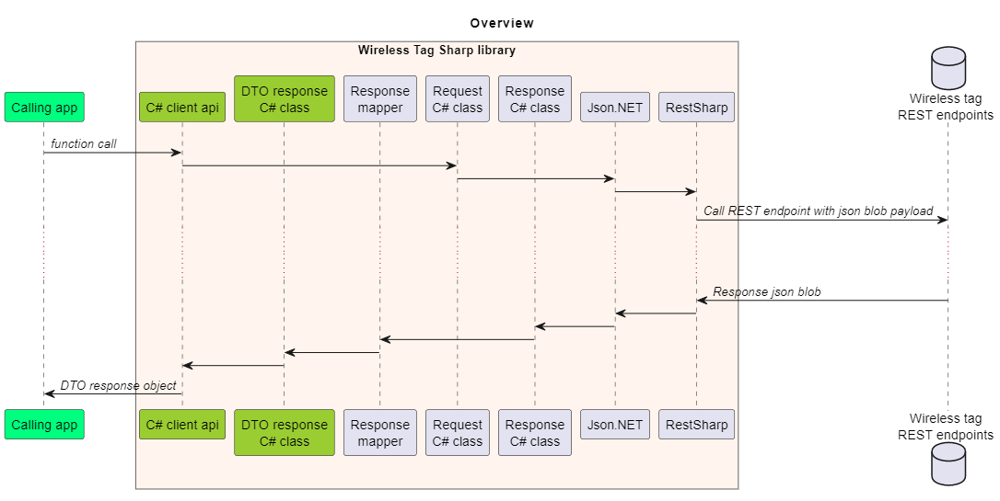

## Introduction
Wireless Sensor Tags are produced by Cao Gadgets LLC (https://www.wirelesstag.net) and monitor temperature, humidity, light etc.

This project provides a C# API running on Windows to a subset of the available REST json endpoints,
and an example console application to fetch and display temperature sensor information.

## Scope
This project provides a C# API to a subset of the available REST json endpoints.

The following C# APIs are available:
* Login
* Get a list of tags
* Get average hourly temperature and humidity data for the specified tag
* Get the date of the earliest and latest available data for a list of tags
* Get the raw temperature and humidity data for a date range for the specified tag


## Technical
This is a library and console application written in C# for the .net framework version 4.7.2.

It uses the following NuGet packages/files:
* [RestSharp](https://restsharp.dev/)
* [Json.NET](https://www.newtonsoft.com/json)
* [Command Line Parser](https://github.com/commandlineparser/commandline)
* [Moq](https://github.com/moq/moq4)

Includes unit tests (MSTest).

## Examples


Three client APIs are provided:
* `WirelessTagJsonClient` - simple synchronous calls to REST API endpoints returning json response string
* `WirelessTagClient` - synchronous calls to REST API endpoints returning strongly typed C# DTO objects
* `WirelessTagAsyncClient` - asynchronous calls to REST API endpoints returning strongly typed C# DTO objects

### WirelessTagJsonClient
```
//
// simple synchronous client returning json strings
//

var client = new WirelessTagJsonClient();

var response = client.Login("username", "password");
var loggedIn = client.IsLoggedIn();

var tagList = client.GetTagList();
Console.WriteLine(tagList);

var temperatureStats = client.GetTemperatureStats(1);
Console.WriteLine(temperatureStats);

var data = client.GetTemperatureRawData(1, DateTime.Today, DateTime.Today);
Console.WriteLine(data);
```

### WirelessTagClient
```
//
// simple synchronous client returning strongly typed DTO objects
//
var client = new WirelessTagClient();
bool loggedIn = client.Login("username", "password");

var tagList = client.GetTagList();

Console.WriteLine($"{tagList.Count} tag(s):");

foreach (var tag in tagList.OrderByDescending(t => t.LastCommunication))
{
    Console.WriteLine($"  {tag.SlaveId} ({tag.Uuid}) ({tag.TagType}) : {tag.Name} : {tag.LastCommunication}, Temperature {tag.Temperature:n1} C, Humidity {tag.RelativeHumidity:n0} %");
}

```

### WirelessTagAsyncClient

```
//
// simple asynchronous client returning strongly typed DTO objects
//
var client = new WirelessTagAsyncClient();

Console.WriteLine($"Connecting to {client.Url}...");

var loggedIn = client.Login("username", "password");
Task.WaitAll(loggedIn);

var tagList = client.GetTagListAsync();
Task.WaitAll(tagList);

Console.WriteLine($"{tagList.Status}");
Console.WriteLine($"{tagList.Result.Count} tag(s):");

foreach (var tag in tagList.Result.OrderByDescending(t => t.LastCommunication))
{
    Console.WriteLine($"  {tag.SlaveId} ({tag.Uuid}) ({tag.TagType}) : {tag.Name} : {tag.LastCommunication}, Temperature {tag.Temperature:n1} C, Humidity {tag.RelativeHumidity:n0} %");
}

```

## Code overview


| Item | File(s) | Description |
| ---- | ------- | ----------- |
| Calling app | n/a | Calling program |
| C# client api | WirelessTagClientLib\Client\WirelessTagJsonClient.cs | API called by calling app. Manages connection to REST endpoints and connection cookie |
| DTO response | WirelessTagClientLib\DTO\\*.cs | C# classes containing results returned from API to calling app |
| Response mapper | WirelessTagClientLib\Mapper\Mapper.cs | Maps result classes to DTO response classes (internal implementation) |
| Request | \WirelessTagClientLib\Requests\\*.cs | C# classes encapsulating eac REST api request (internal implementation) |
| Response | WirelessTagClientLib\Requests\\*.cs | C# classes encapsulating each REST api json response (internal implementation) |
| Json.NET | n/a | .net library for json |
| RestSharp | n/a | .net library for REST operations |
| Wireless tag | n/a | REST endpoints at https://www.mytaglist.com |

Generally each public function in the C# client api corresponds to a call of one REST api endpoint. See https://wirelesstag.net/apidoc.html for further details.


## Testing
* Tested using the included console application.
* Testing is based on the author's tag manager and collection of tags.
* Tested with the following tag types: 12 (Temperature) and 13 (Temperature and Humidity).
* Tested with the following endpoints: https://www.mytaglist.com, https://my.WirelessTag.net and https://my.wirelesstag.net
* Includes unit tests (mstest). Client classes can be mocked. Json responses can be injected into a mock to emulate the real REST endpoints.

## Discovery
This project is based on the REST API documented at https://wirelesstag.net/apidoc.html and subsequent empirical discovery of API behaviours.

Some of the  Wireless Sensor Tags JSON Web Service API Documentation requires login to discover the API.

## Security considerations
Requires username and password for https://www.mytaglist.com; these are passed into the client layer using command line parameters.

Connects to the REST service on the internet at https://www.mytaglist.com

Uses a cookie to authenticate with https://www.mytaglist.com

Once successfully authenticated, then API calls can be made for the duration of that cookie session.

## Author and License
RedFiveCode (https://github.com/RedFiveCode)

Copyright (c) 2014-2022 RedFiveCode (https://github.com/RedFiveCode) All rights reserved.

Released under MIT License (see License.txt file).

## Acknowledgments
This project is not affiliated with Cao Gadgets LLC or https://wirelesstag.net/.

"Wireless Sensor Tags" is trademark of Cao Gadgets LLC

Windows is a trademark of the Microsoft group of companies.

## Further work
* Add further APIs. See <TBA> for instructions.
* Test with further tag type beyond types: 12 (Temperature) and 13 (Temperature and Humidity).
* Port to .net core?
* Rich client application in WPF or Windows Forms?

## Warranty
The author(s) accept no liability or responsibility for any data loss or corruption or damage to sensor tags caused by the use of this application or libraries.
Use of this software is entirely at your own risk; please ensure that you have adequate backups before you use this software.

See License.txt file.

